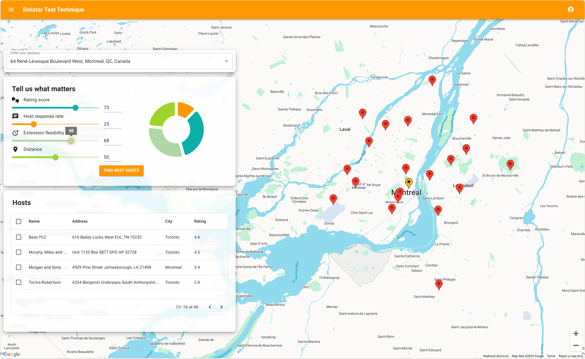
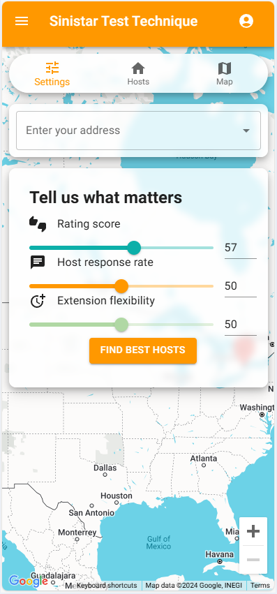

# Sinistar Test Technique

## Installation

This project was built on Node.js version `20.13.1` and npm version `10.5.2`

1. Either obtain a working `.env` file, or make a copy of `.env_template`, rename it to `.env`, and fill it in with the appropriate values
2. Run `npm i`
3. Run `npm start`
4. The development server should now be running on `localhost:3000`

## Description

### Host sorting algorithm

This application makes use of a costum implementation of Quicksort, with the Lomuto partition algorithm. The hosts are sorted based on their score as described below.

### Host scoring algorithm

A host is scored out of 100 based on several criteria. These are their response rate, review score, extension flexibility and, if a user address is inputed, their distance from the user.

Each criterion is weighed using user inputed relative weights ranging from 0-100. That is, the weights do not add up to a constant value. We are only interested in how much each criterion is valued relative to eachother. E.g. a criterion assigned 50 is then 5 times more important to the user than one assigned 10. 

This system was chosen as the concept of absolute value is not needed in the present context. Indeed, each sort operation is conducted based on one specifc assignment of weight. We have no interest in comparing scores between different weight assignments. Furthermore, this has the added benefit of providing a more intuitive user experience as they, nor the UX, has to account of weights adding up to a certain value.

Lastly, each criterion is first normalized out of 1.0 to prevent criteria with larger units from inflating the score. There is, however, the special case of the distance criterion. These have to be calculated everytime an address is inputed by the user. As such, a relative scoring system was chosen for this purpose. This means that every host's distance is scored relative to only every other host **in a given sort**. This score ranges from $0.0-1.0$ as well. It is inversely proportional to the ratio between the target distance, and the greatest distance in the sort. $0.0$ wil then always be given to the host that is further away, and $1.0$ would be given to the host that is at the exact same location as the user.

The calculation for the distance criterion score of host $i$ is as follows: 

$$C_{distance} = 1 - { d_i \over  d_{max}}$$

Where $d_i$ is the distance between the user and host $i$, $d_{max}$ is the greatest distance between a host and the user.

Finally, the calculation for the weighted score of a host is as follows:

$$Score_h = {{\sum_{k=1}^n {W_k*{C_k \over max(C_k)}}} \over  {\sum_{k=1}^n{W_k}}} * 100$$

Where $n$ is the number of criteria, $W_k$ is the weight of criterion score $C_k$, and $max(C_k)$ is the maximum possible value of criterion score $C_k$.

However, in the event of all weights being 0, to a simple unweighted mean. The rationale was that if the user has no perference whatsoever, we would simply sort the list with each criteria weighed equally. This behavior can be replaced by whatever default sorting we want. This behavior is also reflected by the pie chart present during weight selection.

## Available Scripts

In the project directory, you can run:

### `npm start`

Runs the app in the development mode.\
Open [http://localhost:3000](http://localhost:3000) to view it in the browser.

The page will reload if you make edits.\
You will also see any lint errors in the console.

### `npm run build`

Builds the app for production to the `build` folder.\
It correctly bundles React in production mode and optimizes the build for the best performance.

The build is minified and the filenames include the hashes.\
Your app is ready to be deployed!

See the section about [deployment](https://facebook.github.io/create-react-app/docs/deployment) for more information.
